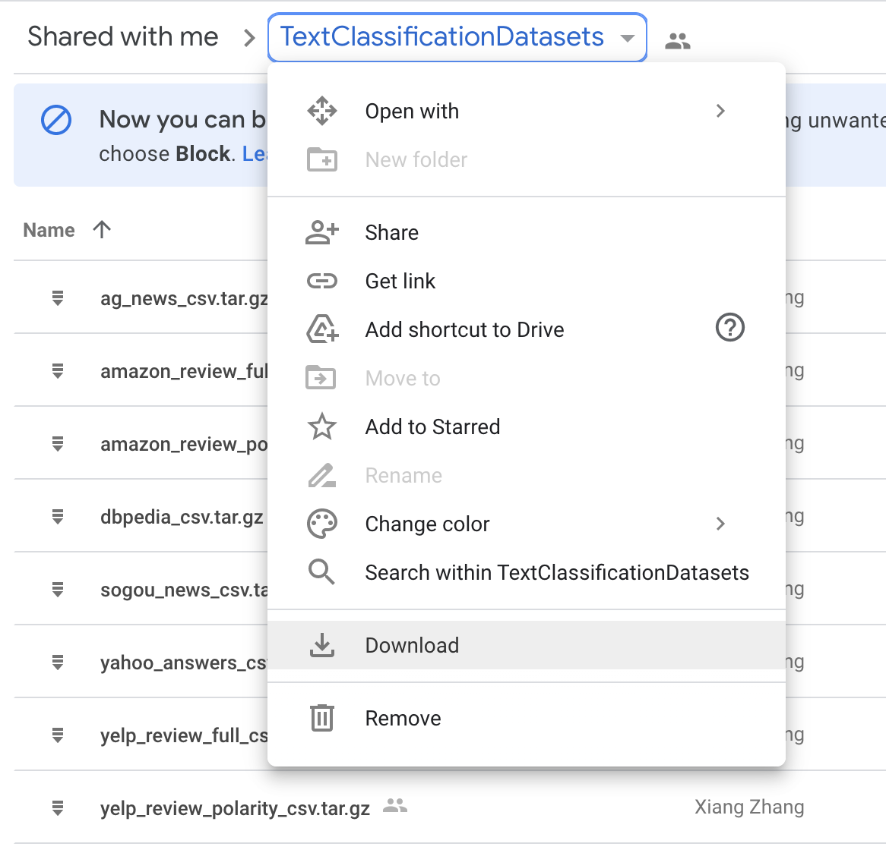
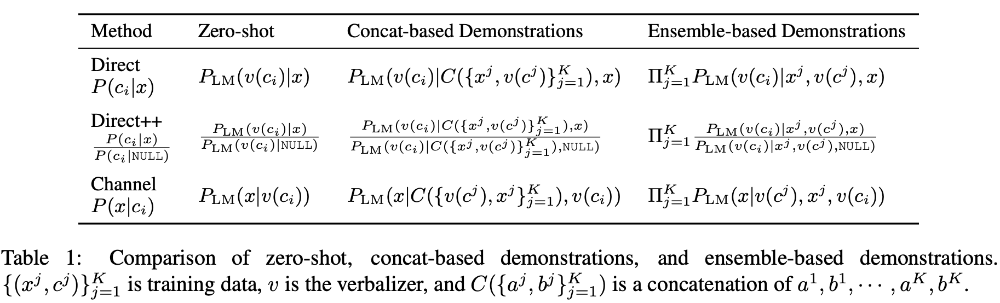
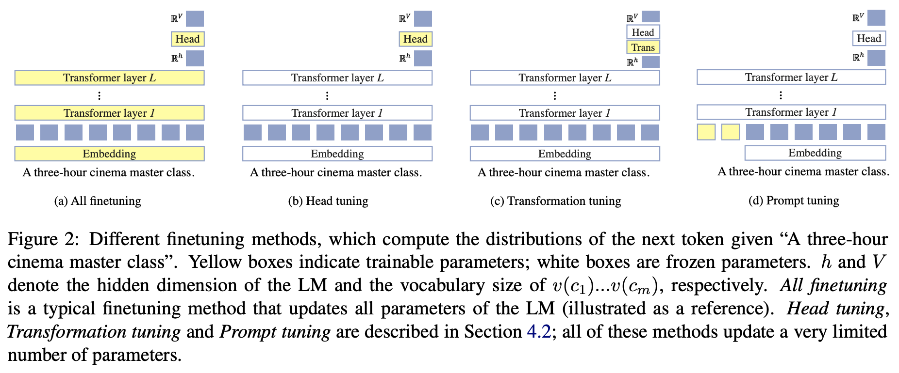

# Channel LM Prompting (and beyond)

This includes an original implementation of Sewon Min, Mike Lewis, Hannaneh Hajishirzi, Luke Zettlemoyer. "[Noisy Channel Language Model Prompting for Few-Shot Text Classification][paper]" 2021.

<p align="center">
  
</p>


For any questions about the paper or the code, or to request pretrained checkpoints, please contact the first author ([email](mailto:cs.washington.edu)) or leave issues.

If you find our code or paper useful, please cite the paper:
```
@article{ min2021noisy ,
  title={ Noisy Channel Language Model Prompting for Few-Shot Text Classification },
  author={ Min, Sewon and Lewis, Mike and Hajishirzi, Hannaneh and Zettlemoyer, Luke },
  journal={ arXiv preprint },
  year={ 2021 }
}
```

This also includes implementations of many recent papers studying prompt-based learning. Please make sure to cite corresponding papers when you use implementations of the methods in this repo.
* Brown et al. NeurIPS 2021. "[Language Models are Few-Shot Learners](https://arxiv.org/abs/2005.14165)": for zero-shot and concat-based demonstration methods.
* Zhao et al. ICML 2021. "[Calibrate before use: Improving few-shot performance of language models](https://arxiv.org/abs/2102.09690)": for direct++ formulations.
* Holzman et al. EMNLP 2021. "[Surface Form Competition: Why the Highest Probability Answer Isn't Always Right](https://arxiv.org/abs/2104.08315)": for direct++ formulations.
* Lester et al. 2021. "[The Power of Scale for Parameter-Efficient Prompt Tuning](https://arxiv.org/abs/2104.08691)": for prompt tuning methods


## Content

1. [Installation](#installation)
2. [Download & Preprocess Data](#download-and-preprocess-data)
3. [Demonstration-based methods](#demonstration-based-methods)
    - [Zero-shot](#zero-shot)
    - [Concat-based demonstration](#concat-based-demonstration)
    - [Ensemble-based demonstration](#ensemble-based-demonstration)
4. [Tuning methods](#tuning-methods)
    - [Prompt tuning](#prompt-tuning)
    - [Head tuning](#head-tuning)
    - [Transformation tuning](#transformation-tuning)
    - [Standard finetuning](#standard-finetuning)

You can run the channel model and the direct model for each of these methods. Please see Section 3 of the [paper][paper] for more details about these formulations.

## Installation

```
$ conda create -n lm-prompt python=3.8
$ conda activate lm-prompt
$ conda install pytorch=1.7.1 -c pytorch
$ pip install transformers==4.3.0
```

## Download and Preprocess Data

We use (and modify) the data and the preprocessing script from Gao et al. ACL 2021 ([paper][lm-bff-paper], [code][lm-bff-code]) and Zhang et al. NeurIPS 2015 ([paper][zhang-paper], [data][zhang-data]).

**To download the k-shot data (already preprocessed):**
Download the data (776MB) from [this link](https://drive.google.com/file/d/1pHbhWzWJZ7HbEQuvwN3-KkqMLRv2TWJf/view?usp=sharing). Pleae place `data.zip` under the same directory as the code and unzip it.

**To download the original data and preprocess yourself:**
```
pip install pandas==1.1.5 # for preprocessing script
mkdir data
cd data
wget https://nlp.cs.princeton.edu/projects/lm-bff/datasets.tar
tar xvf datasets.tar
cd ..
```
Also, download `TextClassificationDatasets.zip` from [here][zhang-data] (download the entire directory as in the figure below)
and place it under `data/original`.
<p align="center">
  
</p>

Then, run `python3 generate_k_shot_data.py`, and you are done!

Optionally, you can specify arguments such as
* `--k`: number of training examples (default is `16`).
* `--balance`: whether or not to guarantee the balance between labels in the training data; more precisely, whether `k` is the number of training examples *in total* or *per label* (default is `False`).
* `--data_dir`: directory for the original data (default is `data/original`).
* `--output_dir`: directory for the preprocessed data (default is `data`).

**To check the data:**
You can see the list of eleven datasets used in the paper by `ls data/k-shot`. Each dataset consists of five different splits based on five different splits (test sets are the same).


## Demonstration-based methods

<p align="center">
  
</p>

This section is for methods which does not update any of the model parameters. For details about methods, please see Section 4.1 of the [paper][paper].

### Zero-shot

```
python main.py \
    --task {task_name} \
    --split {dev|test} \
    --data_dir data \
    --out_dir out \
    --gpt2 gpt2-large \
    --do_zeroshot \
    --method {direct|channel}
```

This command will run zero-shot inference using GPT2-large using four different templates (verbalizers) as reported in the paper.

* For "channel", please specify `--method channel`.
* For "direct", please specify `--method direct`.
* For "direct++", please run the command line without `--split` first (this will run inference using the `N/A` input, following [Zhao et al. ICML 2021](https://arxiv.org/abs/2102.09690)), and then run the command line with `--method direct --use_calibration`.

Useful notes:
* Note that, once you run inference, it will save a cache in the out directory, and will re-load the cache file when you run the exact same command line.
* You can adjust `--batch_size` if you run into OOM issue (default is `32`).
* Please note that GPU parallization is not implemented for inference.
* To save a log file, please specify `--log_file`.
* To use GPT2 with different sizes, please use `--gpt2 {gpt2|gpt2-medium|gpt2-xl}`.

### Concat-based demonstration

```
python main.py \
    --task {task_name} \
    --split {dev|test} \
    --data_dir data \
    --out_dir out \
    --gpt2 gpt2-large \
    --do_zeroshot \
    --method {direct|channel} \
    --use_demonstrations \
    --k 16 \
    --seed {13|21|42|87|100}
```

* You can modify `k` and `seed` to try different numbers of training examples and different seeds for the k-shot data.

### Ensemble-based demonstration

Add `--ensemble` to the command line for the Concat-based demonstration method.


## Tuning methods

<p align="center">
  
</p>

This section is for methods that fully finetune the model parameters (standard finetuning), or update a very limited number of parameters (prompt tuning, head tuning and transformation tuning). For details about the methods, please see Section 4.2 of the [paper][paper].

### Prompt tuning

```
python main.py \
    --task {task_name} \
    --split {dev|test} \
    --data_dir data \
    --out_dir out \
    --gpt2 gpt2-large \
    --method {direct|channel} \
    --prompt_tune \
    --do_train \
    --batch_size 32 \
    --lr {0.1|0.01|0.001}
```

* Please see Appendix B of the [paper][paper] to see which learning rate we used for each dataset.
* Once you train the model, you can specify `--do_check` to load the existing checkpoint without retraining the model.
* Please note that GPU parallization is implemented for training, but is not implemented for inference.
* Note that, by default, we use the checkpoint that is trained for 100 steps.
* To explore different numbers of prompts, please specify `--n_prefix`. The default value is `20`, following the original prompt tuning paper ([Lester et al. 2021](https://arxiv.org/abs/2104.08691)).
* If you want to explore zero-shot task transfer (Section 6.4 in the paper), you can (1) first train the model on the training data, and (2) run inference by specifying `--task {task_name_for_test} --train_task {task_name_for_train} --do_check`.

### Head tuning

Use `--head_tune` instead of `--prompt_tune` to the command line for the Prompt tuning method. Note that head tuning is only for the direct baseline.

### Transformation tuning

Use `--transform_tune` instead of `--prompt_tune` to the command line for the Prompt tuning method. Note that transformation tuning is only for the direct baseline.

### Standard finetuning

To finetune the entire model parameters, as in typical finetuning, please do not specify any of `--prompt_tune`, `--head_tune` or `--transform_tune`.

## Results

For all results, please check out Table 3 and Table 4 of the [paper][paper].


[paper]: https://arxiv.org/abs/2108.04106
[lm-bff-code]: https://github.com/princeton-nlp/LM-BFF/blob/main/tools/generate_k_shot_data.py
[lm-bff-paper]: https://arxiv.org/abs/2012.15723
[zhang-paper]: https://arxiv.org/abs/1509.01626
[zhang-data]: http://goo.gl/JyCnZq


